## (one more) p-bass - build writeup

##### last updated: 2025-05-24

in late october 2024 I decided to build another p-bass[^1]. I also decided to document the build, which you can find below :)

### parts list

* **body:**
    * BloomDoom - P-Style Bass Body - Build Your Own
        * Style: 1962 (Classic P Bass)
        * Wood: Alder
        * Color: Ice Blue Metallic
        * Aging: Closet Clean
        * Checking: None
    * https://bloomdoomguitar.com/shop/p-style-bass-body-build-your-own/
    * ordered: 2024-10-19
    * arrived: 2024-12-28

the ordering process was seamless, and Dustin reached out over email shortly afterwards to double-check the neck pocket dimensions I needed. he emailed me again on 2024-12-17 to confirm my shipping address. great communication, quick turnaround time, and the body is exactly what I wanted - a ~virtually flawless nitrocellulose-lacquer-finished bass body that I can beat up when I play it. BloomDoom doesn't promise "pristine" finsihes, so there are a few small irregularities in the finish, but that's fine with me and was expected. the ice blue metallic color is incredibly pretty (as you can see below), too!

* **neck:**
    * Aluminati - 34" In-Line Aluminum Bass Neck
        * Guitar Headstock Style: 4 In-line A Style
        * Fretboard Materials: Aluminum
        * Neck Finish: Polished
        * Orientation: Right-Handed
        * Tuners: Chrome Gotoh Tuners
        * Inlays: Black
        * Fretwire: Jescar Stainless Steel 57-110 jumbo - 22 frets
        * Optional Neck Plate: None
    * https://aluminatiguitars.com/products/in-line-aluminum-bass-neck
    * ordered: 2024-10-19
    * arrived: 2024-11-23

I love these necks! they're the lightest aluminum bass neck I've played (I also have experience with EGC and Travis Bean Designs necks and basses, respectively), they use high-quality hardware, and they have excellent customer service. I played ~thin, jazz-style necks until I found Aluminati - their necks were, and the ordering process was, so great that I was willing to adjust to the p-bass-style neck. perfect neck for a daily driver bass. James reached out shortly after my order to let me know that my neck would ship soon, despite the fact that Asheville (where they're based) had been hit by terrible flooding on 2024-27-09. the neck arrived without issues, and it looks beautiful.

* **neck plate:**
    * BlaudezGuitars Custom Neck Plate
        * https://www.etsy.com/listing/1795175549/premium-custom-neck-plate-deep-engraved
    * ordered: 2024-11-25
    * arrived: 2024-12-09

I bought the SVG from a stock website, and then sent it to BlaudezGuitars for him to engrave on the neck plate. Ordering from him was incredibly easy, he was easy to communicate with and he finished the engraving the day I made the order. (I followed him on [Instagram](https://www.instagram.com/blaudezguitars/) and he posted my order on his story :) ). crazy turnaround time for an incredibly quality product, I definitely would recommend!

* **pickups:**
    * Nordstrand - NP4A 4 String Precision Bass® Pickup
        * Magnet: Alnico V (Standard)
    * https://nordstrandaudio.com/products/np4a
    * ordered: 2024-10-20
    * arrived: 2024-10-23

I ordered these pickups from [Fat Bass Tone](https://fatbasstone.com/products/nordstrand-np4a-4-string-precision-bass-pickup). The last time I ordered pickups direct from Nordstrand one of the poles on a pickup was demagnetized, and they didn't answer my email about it, so I decided to order from a supplier instead. I went with Fat Bass Tone (lol) because they have excellent [demo videos](https://www.youtube.com/watch?v=61qUpOCJs-w) that are helpful for comparing different pickups. I went with the NP4A 4 because I already have them on another bass and the tone is exactly what I want - it's a high-output p-bass. the angled pole pieces look cool too.

* **bridge:**
    * Babicz - BB-3548-010 - FCH-4 bass Bridge, Z-Series, 5-Hole mount
        * Finish: Chrome
    * https://www.fullcontacthardware.com/fch-z-series-4-string-bass-bridge
    * ordered: 2024-10-19
    * arrived: 2024-10-24

I ordered this bridge from [Allparts](https://www.allparts.com/products/bb-3548-010-babicz-full-contact-babicz-fch-z-series-4-string-bass-bridge) because they were out of stock on the Babicz website. I've installed this bridge on one other bass and liked how easy it was to adjust, so I decided to buy another. I've found that you have to slightly change your palm muting technique with these bridges because of where the string sits in the saddle, however. similar to the other bass hardware, I also think this bridge looks cool.

* **pickguard:**
    * Warmoth - P Bass® Pickguard
        * Color/Material: Black/White/Black
        * Right/Left Handed: Right-Handed
        * Neck Pickup: P Bass® (Split)
        * Controls: Volume 1, Tone 1, Input
    * https://warmoth.com/pg-p
    * ordered: 2024-10-22
    * arrived: 2024-10-30

I initially had a tough time choosing between a white or black pickguard, but some friends helped me go with white. I think that was the right choice for this bass!

* **potentiometers:**
    * CTS - Solid Shaft
        * for tone: CTS, Audio, Solid Shaft, Resistance: 250 kOhm (609722152211)
        * for volume: CTS, Linear, Solid Shaft, Resistance: 250 kOhm (609722152235)
    * https://www.amplifiedparts.com/products/potentiometers_0?filters=1052a1055c147a1052b1758c2341a2363c1758a1759
    * ordered: 2024-10-21
    * arrived: 2024-10-25

I just like how smoothly CTS pots turn :)

* **input jack:**
    * Lumberg - 1/4" Jack - Low Profile, Mono, Open Circuit (KLBM-3)
    * https://www.amplifiedparts.com/products/14-jack-lumberg-low-profile-mono-open-circuit
    * ordered: 2024-10-21
    * arrived: 2024-10-25

I originally wanted to use a Switchcraft jack because I ~feel~ like they're more reliable for repeated plugging/unplugging but it didn't fit, so I went with a Lumberg jack instead. I use these in most of my pedals so I know they work well, I was just a ~bit more worried about the durability of the plastic in the switch after repeated plugging/unplugging, especially with the drastic temperature changes the bass could see here in Michigan. but I took the bass outside in 0 degree F weather for ~10 minutes after I was finished with assembly and the bass was fine after that, so I'm not gonna worry about it anymore 🤷‍♀️. 

* **knobs:**
    * Love My Switches - Silver Aluminum Skirt Knob - "The Cosmonaut" - 1/4" Smooth Shaft
        * 29mm
    * https://lovemyswitches.com/silver-aluminum-skirt-knob-the-cosmonaut-1-4-smooth-shaft/
    * ordered: 2024-11-23
    * arrived: 2024-12-02

I love Love My Switches, and I usually try to order pedal hardware and knobs from them. I actually ordered several different knobs for this project, but decided I liked the look of the Cosmonauts the most. 

* **wiring:**
    * 22 AWG cloth stranded copper wire

I ordered these wires from Amazon with the copper tape and some other essentials. Amazon accidentally delivered the wires and copper tape to my neighbor's house, and I had to go over to retrieve it. when I knocked on their door, a knee-high-tall kid peeked out from behind the side window curtain for a second, and then popped out the side door with his two siblings. they gave me my package but it was opened :O - those rascals! just kidding, I wouldn't have cared if they had stolen it. I ended up hating the cloth wire so maybe it would've been better if they did!

* **copper tape:**
    * LOVIMAG copper foil tape (2inch x 33 ft) with conductive adhesive

* **strap buttons:**
    * Jim Dunlop Strap Button Set (7102)
        * https://www.jimdunlop.com/dunlop-strap-button-set/

I bought these for two reasons:

1) the color matches the rest of the metal hardware on the bass
2) they're aluminum!

* **capacitor:**
    * Panasonic - Film Capacitor - 250VDC 0.047uF 5% MPET L/S=5mm (ECQ-E2473JB)
    * ordered: 2024-10-21
    * arrived: 2024-10-24

I usually go with Mouser for my electronic components because they ship really fast and I like the name. I think film caps are the best for this specific use-case (10s nF range, audio application) but I don't think you need a certain kind of film cap - any cap that fits the specs should be fine. pickup voltages are super low too, you'd probably have trouble finding a film cap that couldn't handle it. a C0G/NP0 ceramic cap would probably be fine too tbh!

### the build writeup

I initially had the idea for this project in early October 2024. until recently, I've preferred jazz basses over precision basses. but in 2022 I assembled a p/j bass and realized I actually really like the precision sound (this is just like when I finally gave in and started ~exclusively playing with a pick). I knew I wanted an Aluminati neck, but it took me bit of time to decide on the color of the bass. in the end I went with ice blue metallic, and I'm happy I did :)

so, I ordered the parts:

[**pic 1: inspecting the neck after unboxing - it was perfect, as expected!**]
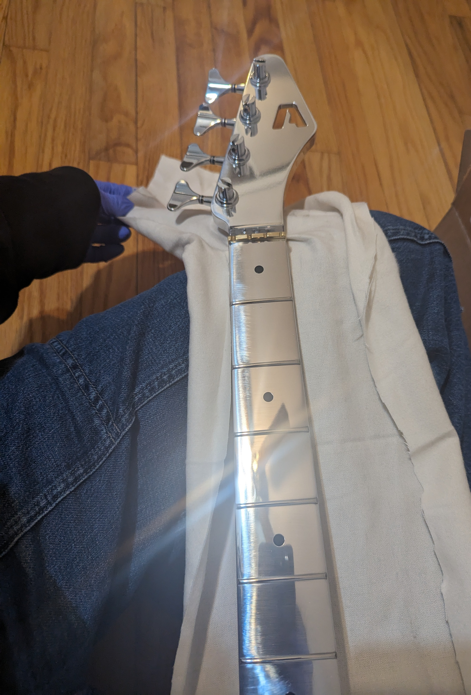

[**pic 2: inspecting the neck plate after delivery. I love it :)**]
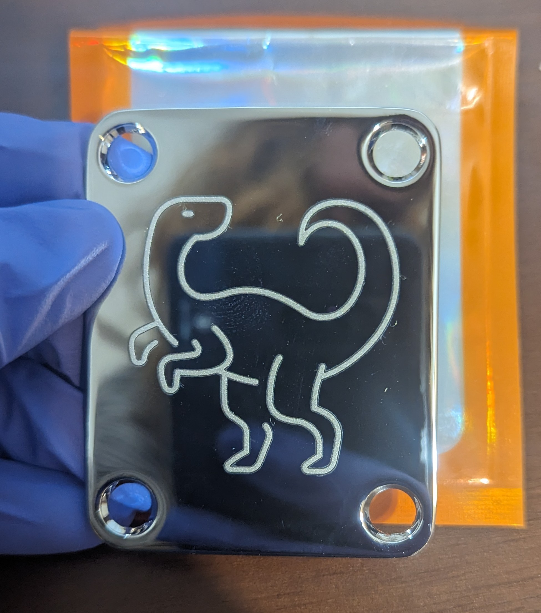

[**pic 3: unboxing the bass body. it's so beautiful!**]
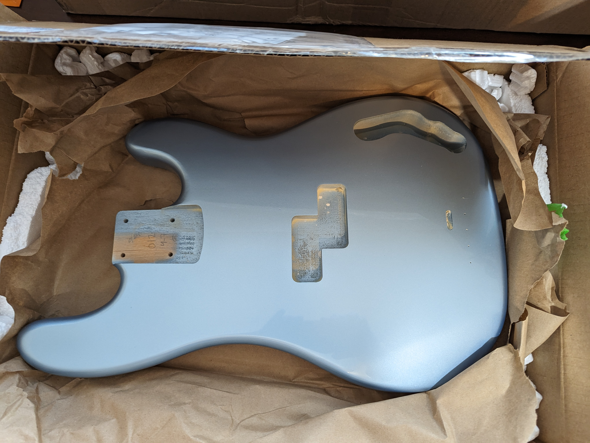

not pictured: everything else that I ordered.

after everything was delivered, I waited until my Christmas/New Years PTO to begin assembly. when the time came, I prepared the build area and started the build by attaching the neck to the body. first, I slid the neck into the body's neck pocket and checked the fit:

[**pic 4: lgtm!**]
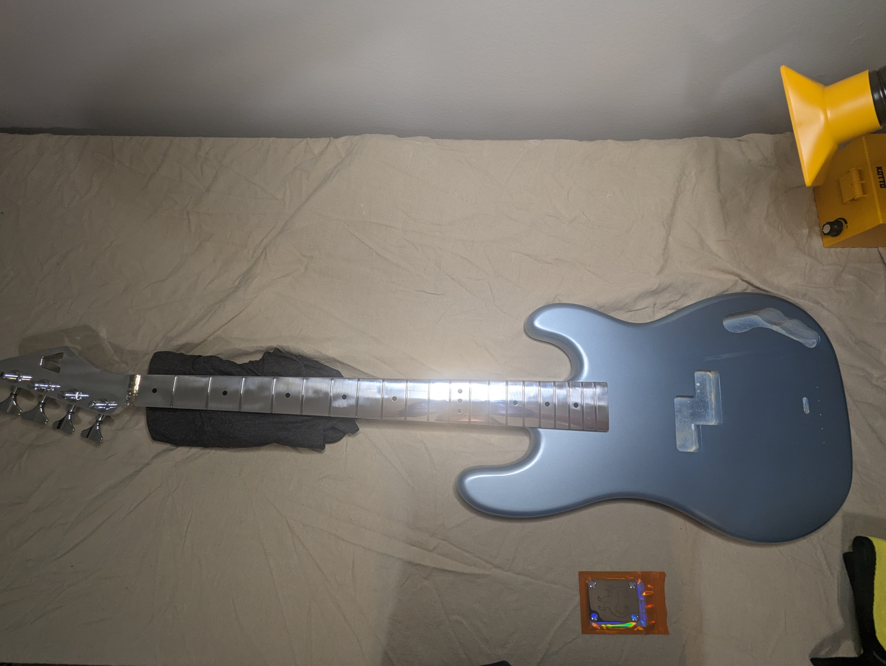

unfortunately, I chipped some of the paint during that part. not a huge deal though, I'm okay with battle scars on this bass!

[**pic 5: first scar**]
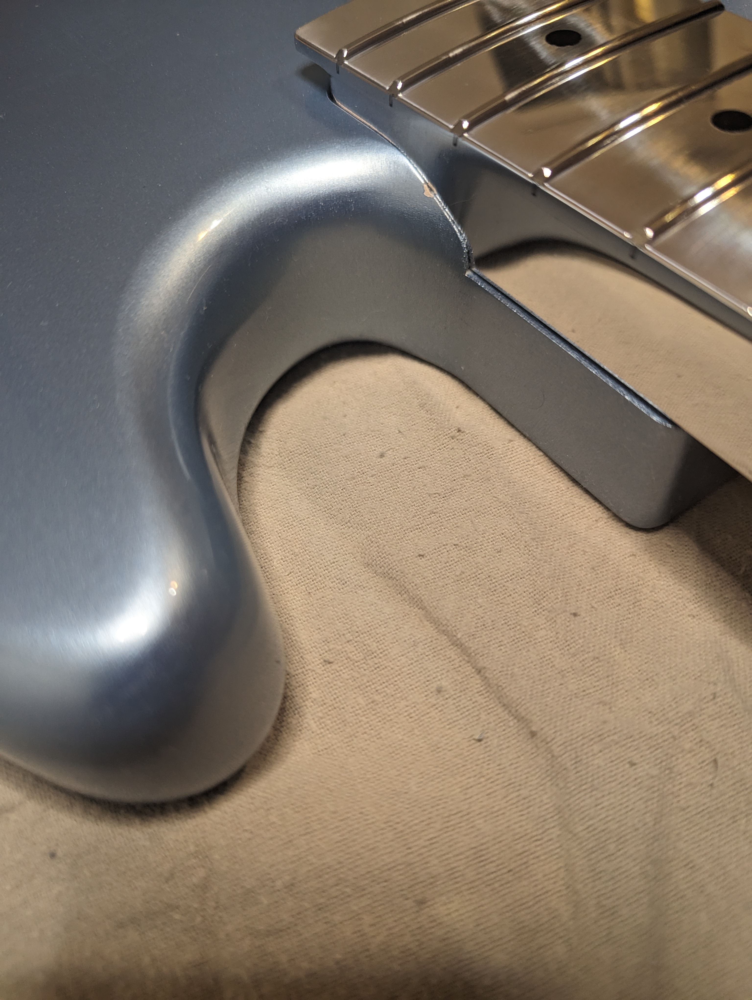

after confirming the neck fit in the pocket, I flipped the bass over and prepared to screw the neck to the body. I used some candle wax that I stole from my former housemate [Tyler](https://www.tylerfloydaudio.com/) (side note - if you need a producer or audio engineer in Chicago check him out, he's great at what he does) to slightly lubricate the screws. I actually used this candle wax on screws throughout the assembly - thanks Tyler!

[**pic 6: ready to screw the neck in**]
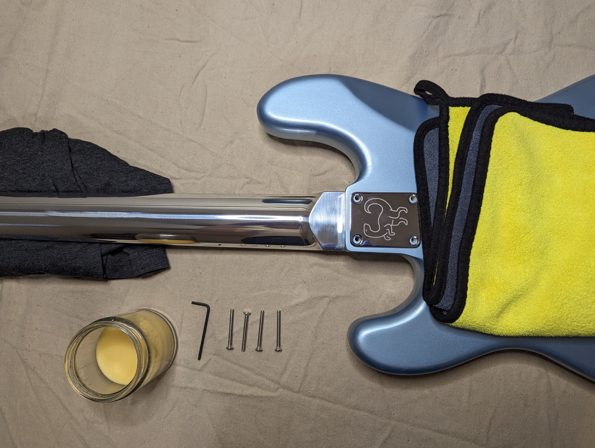

once the neck was on, I screwed the bridge into the bass. I totally forgot about the bridge's ground wire, so I would actually have to unscrew this later, lol.

[**pic 7: preparing to screw in the bridge**]
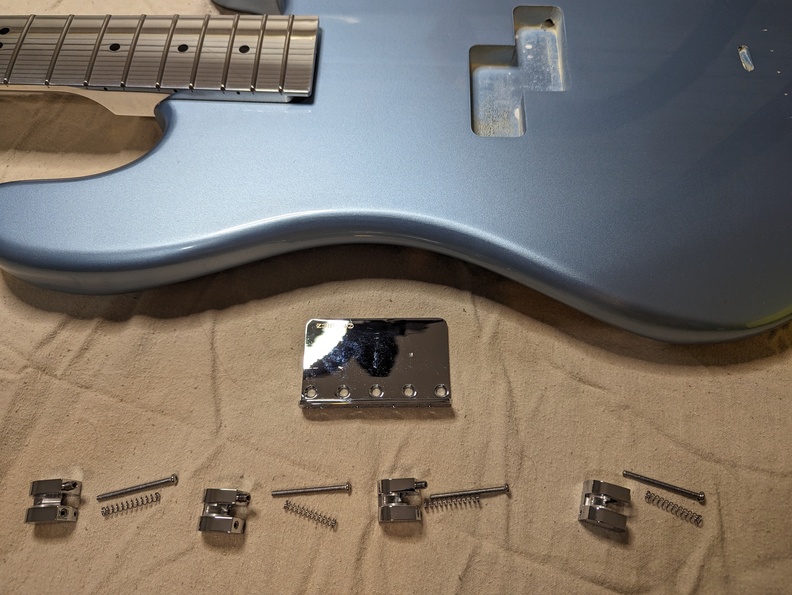

after the bridge was screwed in, I checked the pickguard fit, taped it to the body, and prepared to drill the pickguard screw holes:

[**pic 8: taping the pickguard**]
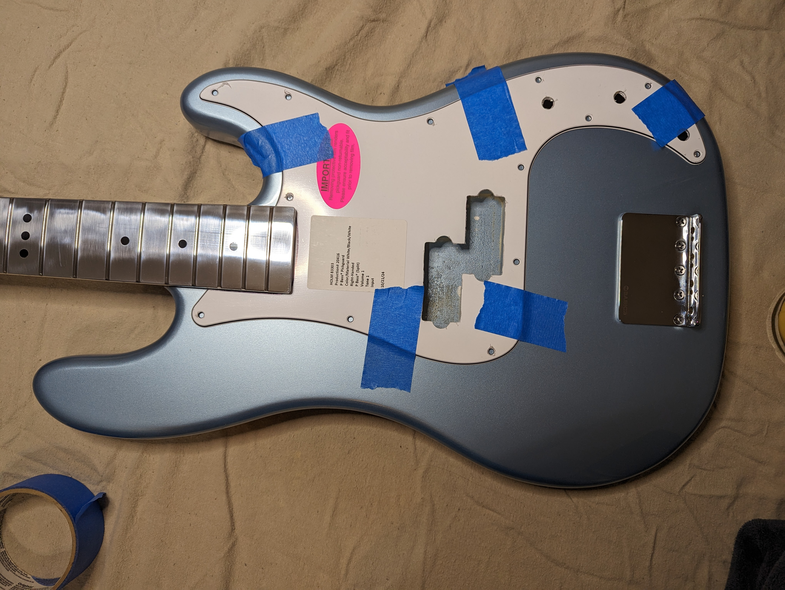

I taped the drill bit to ensure I didn't drill too deep (but maybe I did anyways? some of the screws screw-in fully, but I can still turn them if I twist firmly enough. I think it's fine 🤷‍♀️, but I'll use some toothpicks and wood glue if it becomes an issue.)

[**pic 9: taping the drill bit**]
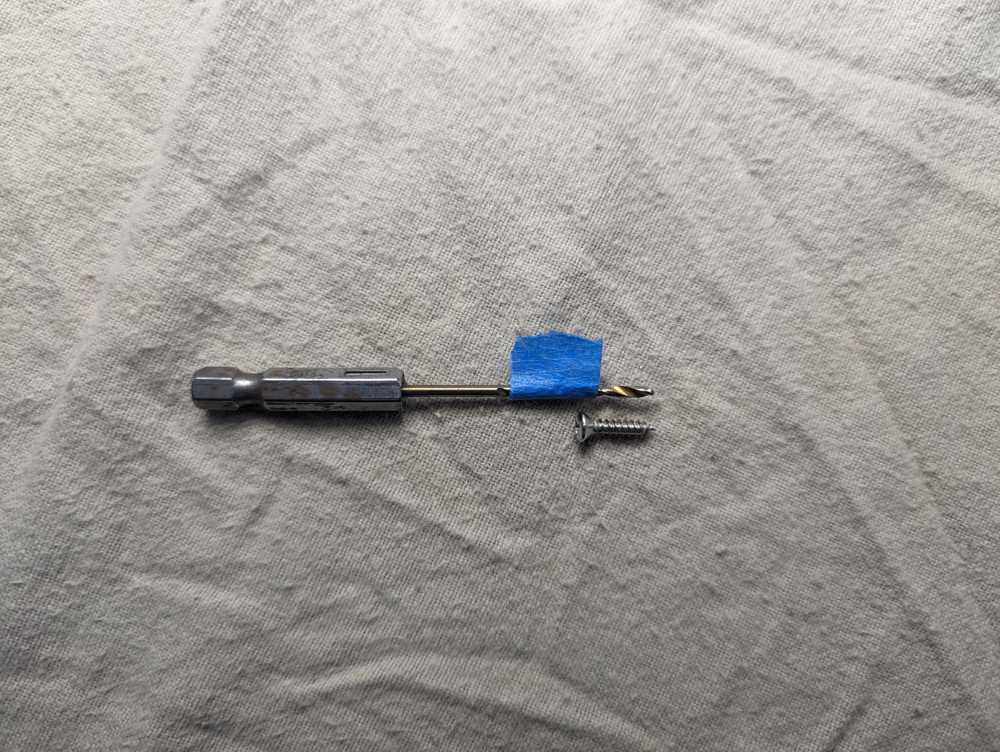

the tools (minus drill):

[**pic 10: candle wax, a screw, a center punch, and a screwdriver**]

I put the bass on my floor for drilling so I could easily maneuver around it. my knees did hurt after a bit though.

[**pic 11: prepared to drill the pickguard holes**]
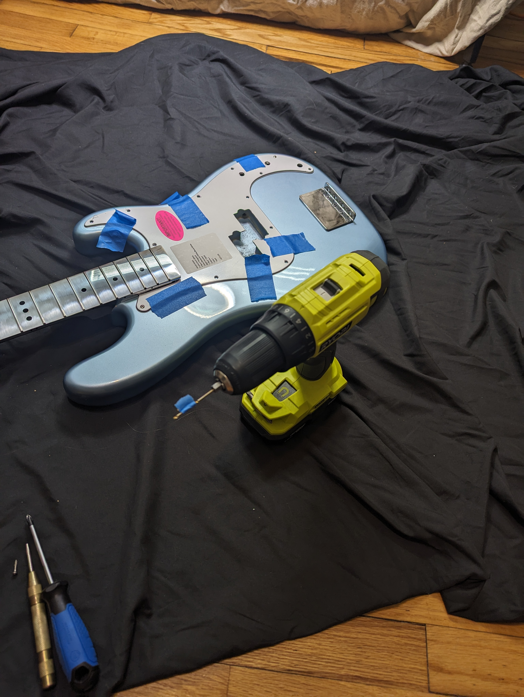

after some nerve-wracking drilling (drilling is my least favorite part about assembling an instrument, I'm always worried I'll mess up the paint) I got the pickguard on:

[**pic 12: pickguard on!**]
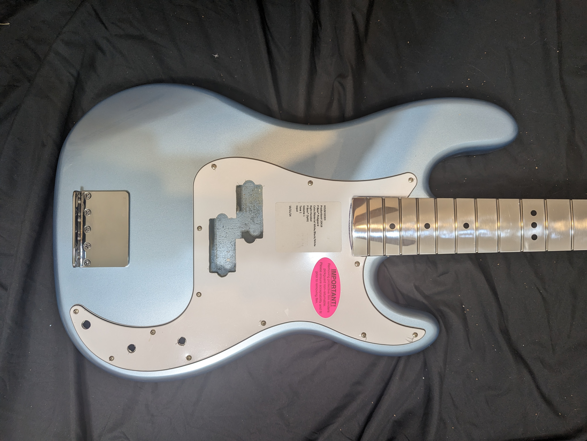

next, I dropped the pickups into the bass with some foam so I could drill the screws for the pickups.

[**pic 13: placing the pickups**]
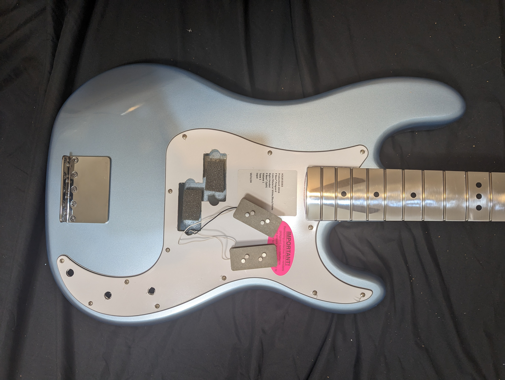

after I drilled the pickup screws, I removed the pickguard, bridge, and pickups so I could shield the pickup and control cavities by covering them in the copper foil tape. this is my least favorite part of bass assembly besides drilling, because the copper tape usually cuts my hands. thankfully, I only cut my finger once while I was shielding the bass, but I did shred the nitrile gloves I was wearing. 

[**pic 14: preparing to screw in the bridge**]

[**picture 4: title or brief description of the picture**]

[**picture 5: title or brief description of the picture**]

  

#### footnotes:
[^1]: [fender precision bass](https://en.wikipedia.org/wiki/fender_precision_bass)